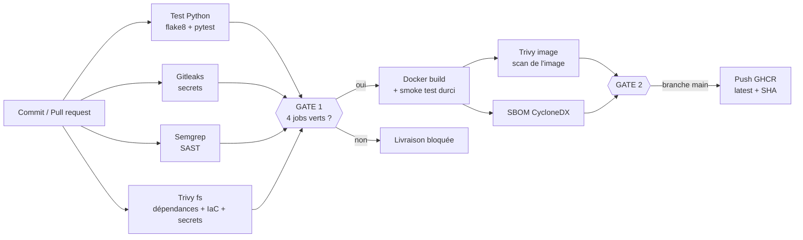

# Rapport – Secure Delivery Platform

**Projet** : chaîne CI/CD sécurisée pour une application Flask conteneurisée (GitHub Actions + GitHub Container Registry)
**Dépôt** : `Baye-ngouda/devsecops-todo-`

---

## 1. Enjeux du projet

Une application moderne dépend de dizaines de bibliothèques, d'une image de base, d'un Dockerfile et d'actions CI tierces. Chacun de ces éléments est un point d'entrée possible pour une attaque (attaque de la chaîne d'approvisionnement, secret divulgué, dépendance vulnérable, code malveillant dans une contribution).

L'objectif est de **déplacer la sécurité au plus tôt** (« shift-left ») : à chaque commit, le pipeline vérifie automatiquement la qualité, cherche les secrets, les failles de code, les dépendances vulnérables et les mauvaises configurations, et **bloque la livraison** si un problème grave est détecté. Seule une image conforme atteint le registry.

L'application elle-même (une todo-list Flask) est volontairement simple : l'enjeu est le **processus de livraison**, pas l'application.

## 2. L'application et les technologies

**Application** : « DevSecOps Todo », une todo-list web (ajouter, cocher, supprimer une tâche) écrite en Python avec Flask. Routes : `/` (interface), `/add`, `/toggle/<id>`, `/delete/<id>`, `/api/todos` (JSON) et `/health` (état et version). Les tâches sont gardées en mémoire (pas de base de données : hors périmètre). 6 tests automatisés (pytest) couvrent la santé, l'ajout, le basculement, la suppression, les entrées vides et l'échappement HTML.

| Domaine | Technologie |
|---|---|
| Langage et framework | Python 3.12, Flask 3.1, Jinja2 |
| Serveur d'application | gunicorn (2 workers) |
| Conteneur | Docker, build multi-stage, image `python:3.12-slim`, utilisateur non-root |
| Qualité | flake8, pytest |
| CI/CD | GitHub Actions |
| Sécurité | Gitleaks, Semgrep, Trivy (fs, image), SBOM CycloneDX |
| Registry et livraison | GitHub Container Registry : `ghcr.io/baye-ngouda/devsecops-todo` (tags `latest` et SHA du commit) |
| Gouvernance | règle de protection de `main`, CODEOWNERS, push protection GitHub |

**Lancer l'application** : `docker run --rm -p 5000:5000 ghcr.io/baye-ngouda/devsecops-todo:latest`, puis ouvrir http://localhost:5000.

**Étapes de sécurité réalisées** : (1) détection de secrets, (2) analyse statique du code, (3) analyse des dépendances et du Dockerfile, (4) construction d'une image durcie et test de démarrage, (5) analyse de l'image, (6) génération du SBOM, (7) publication conditionnelle dans le registry, (8) protection de la branche principale. Le détail est dans la partie 3.

## 3. Schéma du pipeline CI/CD

| Étape | Outil | Rôle |
|---|---|---|
| Qualité | flake8, pytest | style et 6 tests fonctionnels |
| Secrets | Gitleaks | détecte clés et mots de passe dans le code et l'historique |
| SAST | Semgrep (`p/python`, `p/flask`) | failles dans le code source |
| Dépendances et IaC | Trivy `fs` | CVE des paquets, mauvaises configurations du Dockerfile, secrets |
| Image | Trivy `image` | CVE de l'image finale |
| Traçabilité | SBOM CycloneDX, artefacts | inventaire des composants conservé comme preuve |
| Livraison | GHCR | publication uniquement depuis `main` |

**Politique de sécurité (security gate)** : CRITICAL et HIGH bloquent le pipeline (`exit-code 1`) ; MEDIUM est un avertissement ; LOW est informatif. Les jobs de build, de scan d'image et de livraison dépendent des scans (`needs`) : ils ne démarrent pas si un scan échoue. Une règle de protection de `main` exige les checks obligatoires avant fusion.

**Durcissement** : image `slim` multi-stage, utilisateur non-root (UID 10001), `HEALTHCHECK`, dépendances épinglées. Le smoke test lance le conteneur en lecture seule, avec `--cap-drop ALL` et `no-new-privileges`. Les permissions du workflow sont limitées à `contents: read` (le job de livraison reçoit seul `packages: write`).

## 4. Règles de sécurité côté Git et workflow de travail

**Workflow de travail** : on ne pousse jamais directement sur `main`. Le cycle est : branche → pull request → pipeline complet → fusion uniquement si tous les contrôles sont verts → nouveau pipeline sur `main` qui publie l'image dans le registry. GitHub a d'ailleurs refusé un commit direct sur `main` et a créé une branche à la place, ce qui confirme que la règle est appliquée.

| Mesure | Détail |
|---|---|
| **Règle de protection de `main`** (ruleset « Protection main », active, liste de contournement vide) | pull request obligatoire ; **6 checks obligatoires** (Test Python, Gitleaks, Semgrep, SCA - Trivy, Container Scan - Trivy, Garde) ; push forcé bloqué ; suppression de la branche interdite |
| **CODEOWNERS** | désigne les relecteurs de tout le dépôt, et en particulier de `.github/` (workflow), du `Dockerfile` et de `requirements.txt` |
| **Job « Garde »** | refuse tout fichier d'ignore ou de configuration d'un scanner (`.trivyignore`, `.gitleaks.toml`, `.semgrepignore`, `trivy.yaml`…), pour empêcher une PR de désactiver les contrôles |
| **Push protection GitHub** | a bloqué le push de la clé AWS fictive de la branche `challenge` avant même le pipeline |
| **Workflows** | déclencheur `pull_request` (jamais `pull_request_target`) : une PR externe ne reçoit ni secret ni droit d'écriture ; permissions limitées à `contents: read`, avec `packages: write` seulement pour le job de publication, et seulement sur `main` |
| **Composants tiers** | actions et dépendances en versions précises, vérifiées avant usage, jamais `@master` |

**Limite assumée** : l'équipe n'a que deux personnes, donc la règle n'exige pas d'approbation obligatoire (0 relecteur requis). Les CODEOWNERS désignent les relecteurs mais ne bloquent pas la fusion. Le cas de la PR #1 (partie 6) montre que cette revue humaine est un maillon faible : c'est pourquoi les contrôles automatiques, eux, sont obligatoires.

## 5. Analyse de risques

| # | Risque | Impact | Probabilité | Mesure en place | Risque résiduel |
|---|---|---|---|---|---|
| R1 | Secret (clé, mot de passe) committé | Élevé | Moyenne | Gitleaks + Trivy secret + *push protection* GitHub | Faible |
| R2 | Dépendance vulnérable (CVE) | Élevé | Élevée | Trivy fs et image, versions épinglées et vérifiées | Faible à moyen (CVE sans correctif ignorées) |
| R3 | Faille dans le code (injection SQL/commande, `debug=True`) | Élevé | Moyenne | Semgrep, tests | Moyen (règles génériques) |
| R4 | Dockerfile non sûr (root, image obsolète, secret en `ENV`) | Moyen | Moyenne | Trivy misconfig, durcissement | Faible |
| R5 | **Action CI compromise** (chaîne d'approvisionnement) | Très élevé | Faible à moyenne | Versions vérifiées, jamais `@master`, permissions minimales | Moyen (tags non figés par SHA) |
| R6 | **Contribution malveillante** (PR externe) | Élevé | Moyenne | Workflow `pull_request` (jeton en lecture seule, sans secret), checks obligatoires sur `main`, revue par le propriétaire | Moyen (voir partie 6) |
| R7 | Image non conforme publiée | Élevé | Faible | La publication dépend des deux gates et se limite à `main` | Faible |

Vérification des composants : les versions des actions et des dépendances ont été contrôlées avant usage (remarque du prof). Cela s'est révélé important : l'action `trivy-action` a subi une compromission en mars 2026 (anciennes versions malveillantes) ; la version 0.36.0, sûre, est utilisée.

## 6. Partie bonus Red Team

### 6.1 Branche `challenge` (attaque simulée par nous)

Une pull request `challenge` introduit volontairement cinq défauts :

| Défaut introduit | Fichier | Détecté par | Résultat |
|---|---|---|---|
| Clé AWS fictive | `config.py` | Gitleaks (et *push protection* GitHub) | bloqué |
| `requests 2.19.1`, `urllib3 1.23` | `requirements.txt` | Trivy | bloqué |
| Image `python:3.8`, root, mot de passe en `ENV` | `Dockerfile` | Trivy misconfig | bloqué |
| Injection SQL, injection de commande, `debug=True` | `app.py` | Semgrep | bloqué |

Résultat : Gitleaks, Semgrep et Trivy échouent ; build, scan d'image, SBOM et livraison sont **ignorés** ; rien n'atteint le registry.

### 6.2 Contribution malveillante réelle (PR #1)

Un camarade a ouvert une pull request contenant du code qui exécute une commande système pour envoyer des données de l'environnement vers un serveur externe (scénario d'exfiltration de secrets de CI).

Constats honnêtes :
- Le pipeline a bien échoué, mais **uniquement sur le job de tests/lint** ; Gitleaks, Semgrep et Trivy sont restés verts. Les règles génériques de Semgrep n'ont pas signalé un `os.system(...)` avec une chaîne constante.
- La PR n'a pas été fusionnée : le propriétaire du dépôt l'a refusée puis fermée. Mais un autre relecteur l'avait **approuvée à tort** (« safe ») : la revue humaine est faillible.
- Le workflow `pull_request` limite les dégâts : une PR externe n'a accès à aucun secret et reçoit un jeton en lecture seule.

**Leçon** : les scanners automatiques ne suffisent pas ; ils doivent être combinés avec une revue obligatoire et des règles adaptées.

### 6.3 Neutralisation des gates par la configuration (PR #3)

Une troisième pull request, intitulée « [RED TEAM — DO NOT MERGE] Les configurations de scanners permettent de neutraliser les gates », a démontré une faille de conception : les scanners lisent leur configuration **dans le dépôt**, donc dans le code de la PR elle-même. Une PR peut ajouter ou modifier un fichier d'ignore ou de configuration (`.trivyignore`, `.gitleaks.toml`, `.semgrepignore`, `trivy.yaml`) pour faire taire les alertes.

Constat : sur cette PR, Test Python, Gitleaks, Semgrep et SCA-Trivy sont restés **verts** ; seul `Docker Build` a échoué, pour une raison sans rapport avec la sécurité. Les gates n'ont donc pas été le facteur bloquant.

**Corrections mises en place** :
- un job **« Garde - configuration des scanners »** qui échoue si le dépôt contient un fichier d'ignore ou de configuration de scanner ; le build en dépend ;
- un fichier **CODEOWNERS** qui désigne les relecteurs de toute modification, en particulier du workflow (`.github/`) ;
- une **règle de protection de `main`** : pull request obligatoire, checks obligatoires (dont le job Garde), commit direct refusé.

Limite restante : une PR peut aussi supprimer le job Garde dans le workflow ; seule une revue obligatoire par un code owner couvrirait ce cas. Elle n'est pas encore activée (voir « améliorations »).

## 7. Ce qu'il resterait à améliorer

1. **Règle Semgrep personnalisée** interdisant `os.system` et `subprocess(..., shell=True)` (le cas de la PR #1).
2. **Activer la revue obligatoire** (1 approbation d'un code owner) dans la règle de protection : elle est prévue mais pas activée, faute d'un second relecteur fiable dans l'équipe.
3. **Figer les actions par SHA de commit** (et non par tag), avec Dependabot pour les mises à jour.
4. **Signer les images** (cosign) et publier une attestation de provenance (SLSA).
5. **Déploiement réel** : serveur ou orchestrateur (Kubernetes non exigé ici), avec scan continu de l'image en production et mise à jour automatique.
6. **Politique d'exceptions** : suivre explicitement les CVE ignorées (`ignore-unfixed`) et leur date de revue.
7. **Tests de sécurité dynamiques (DAST)**, par exemple OWASP ZAP sur l'application déployée.
8. **Persistance** de l'application (base de données) et authentification : hors périmètre du TP.

## 8. Conclusion

La chaîne livre automatiquement une image Flask durcie, scannée à quatre niveaux (secrets, code, dépendances/IaC, image), tracée par un SBOM, et **bloque** les contributions dangereuses. Le test Red Team montre aussi les limites : la sécurité repose sur la combinaison de **contrôles automatiques et de revue humaine**.
